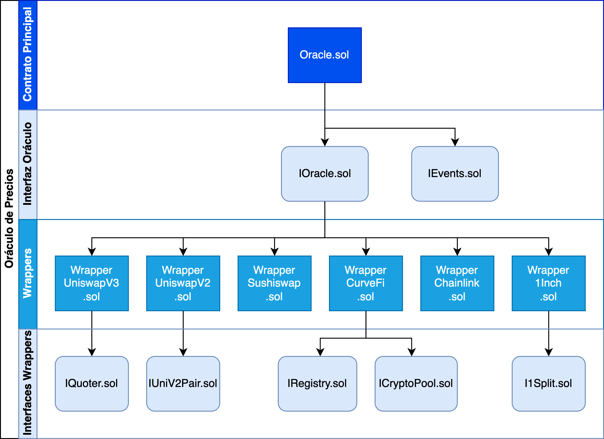

# Price Oracle for Automated Market Makers
**Project completed on June 2022**

## Project Overview

This project implements a Price Oracle designed to aggregate and provide reliable, real-time token pricing information across multiple Automated Market Maker (AMM) platforms.  
The solution was developed as part of a practical study on decentralized finance infrastructure and focuses on the engineering and implementation aspects of an interoperable oracle system using Smart Contracts.

The system retrieves on-chain price data directly from decentralized exchanges and aggregators such as Uniswap V2, Uniswap V3, Sushiswap, 1inch, Curve, and Chainlink.  
It allows developers or automated agents to query and compare exchange rates between token pairs, selecting the most favorable swap conditions.

---

## Disclaimer

This project was developed for academic purposes only.  
It is not intended for production use, and no guarantees are made regarding its security, performance, or functionality.  

---

## Project Scope and Objectives

The objective of the project was to **design and implement** an Oracle capable of returning **accurate and up-to-date pricing** for token pairs across multiple decentralized protocols.  
The oracle was conceived as a **modular, extensible system** composed of smart contracts written in **Solidity**, capable of being deployed and queried directly on-chain.

### Core Functionalities

- **R1 – Retrieve Token Pair Price:**  
  Returns the swap ratio for a pair of crypto assets (A/B), based on their smart contract addresses.

- **R2 – Best Price Discovery:**  
  Compares prices across all registered sources and returns the most favorable exchange rate.

- **R3 – Add Price Source:**  
  Allows new data sources (DEX protocols) to be dynamically integrated into the oracle registry.

- **R4 – Remove Price Source:**  
  Enables the removal of sources from which the oracle collects data.

- **R5 – Retrieve Price from Specific Source:**  
  Returns the price of a token or swap pair from a chosen liquidity source.

- **R6 – Set Default Data Source:**  
  Defines a default protocol to ensure that all queries produce a valid price response.

The design intentionally omits any front-end or user interface, emphasizing **direct smart contract invocation**.  
This decision prioritizes on-chain efficiency and transparency over graphical presentation.

---

## System Design

The oracle system follows a modular and layered architecture that separates responsibilities across dedicated smart contracts.  
This structure allows for extensibility, maintainability, and integration with multiple decentralized exchange (DEX) protocols.

The design is divided into four main layers:

1. **Main Contract Layer**

   - **Oracle.sol**: The core contract responsible for aggregating data from different sources.  
     It queries wrapper contracts, computes comparative prices, and exposes standardized functions to retrieve token pair values.

2. **Oracle Interface Layer**

   - **IOracle.sol** and **IEvents.sol**: Define the external functions and event structures used to interact with the oracle.  
     This ensures consistent communication between the oracle core and external applications or protocols.

3. **Wrapper Layer**

   - Contains individual adapters (“wrappers”) for each supported DEX or pricing protocol.  
     These wrappers implement a uniform interface so that the oracle can interact with heterogeneous sources transparently.  
     Included wrappers:
     - `WrapperUniswapV3.sol`
     - `WrapperUniswapV2.sol`
     - `WrapperSushiswap.sol`
     - `WrapperCurveFi.sol`
     - `WrapperChainlink.sol`
     - `Wrapper1Inch.sol`

4. **Wrapper Interface Layer**
   - Defines the specific interfaces used by each wrapper to communicate with their corresponding protocols.  
     These files abstract protocol-specific logic, ensuring modularity and easier integration of future sources.  
     Included interfaces:
     - `IQuoter.sol`
     - `IUniv2Pair.sol`
     - `IRegistry.sol`
     - `ICryptoPool.sol`
     - `I1Split.sol`

This layered design allows the oracle to be easily extended by adding new wrappers and interfaces without modifying the main oracle contract.  
Each component interacts through well-defined interfaces, ensuring scalability and interoperability across different AMMs and on-chain data providers.



---

## Installation and Setup

To install and execute the implementation on a new environment, follow these steps (as outlined in Annex 2 of the report):

### 1. Install Node.js

Ensure Node.js is installed.  
Download it from:  
[https://nodejs.org/en/download](https://nodejs.org/en/download)

### 2. Clone the Boilerplate Repository

Choose a root directory and clone the Solidity boilerplate used as the base for this project (includes Hardhat):

```bash
git clone https://github.com/defi-wonderland/solidity-boilerplate.git
```

### 3. Install Dependencies with Yarn

Navigate into the cloned directory and install dependencies:

```bash
yarn install
```

### 4. Install External Libraries

#### a) Uniswap V3 Libraries

Install the Uniswap core and periphery packages directly from the GitHub repositories:

```bash
npm i https://github.com/lbertenasco/uniswap-v3-core.git
npm i https://github.com/lbertenasco/uniswap-v3-periphery.git
```

#### b) Chainlink and Sushiswap Dependencies

Install additional libraries used by the oracle:

```bash
npm i @chainlink/contracts
npm i @sushiswap/core
```

### 5. Configure Environment Variables

Duplicate the `.env.example` file as `.env` and configure your Ethereum mainnet provider.  
For this project, **Infura** was used as the access provider:

```bash
NODE_URI_MAINNET=https://mainnet.infura.io/v3/YOUR_PROJECT_KEY
```

You can create a free Infura account at [https://infura.io](https://infura.io).

---

### 6. Configure eth-sdk

Inside the `eth-sdk` module, open the `config.ts` file and include the contract addresses you intend to query.  
Then export the types with the following command:

```bash
yarn eth-sdk
```

### 7. Add Smart Contracts and Tests

Copy the smart contracts and test files from the `solidity` directory of this project into the respective folders:

```bash
solidity/contracts/
solidity/interfaces/
```

### 8. Compile and Test

To compile the contracts:

```bash
yarn compile
```

To run the test suites:

```bash
yarn test:unit
yarn test:e2e
```

## Testing and Simulation

Unit and integration tests validate:

- Correct price retrieval per source
- Best price computation
- Dynamic source registration and removal
- Oracle fallback behavior using default data sources

These tests confirm that the oracle can dynamically manage and query decentralized exchange sources to deliver consistent price data.

---

## Future Development

Further work could focus on:

- Expanding source coverage to new AMMs
- Integrating aggregation algorithms for more advanced pricing logic
- Deploying the oracle to additional EVM-compatible networks

---

## Acknowledgments

This implementation was based on the **Defi Wonderland Solidity Boilerplate** and integrates open-source libraries from **Uniswap**, **Sushiswap**, and **Chainlink**.  
It was developed as a practical case study on **cross-protocol price discovery** within decentralized markets.
